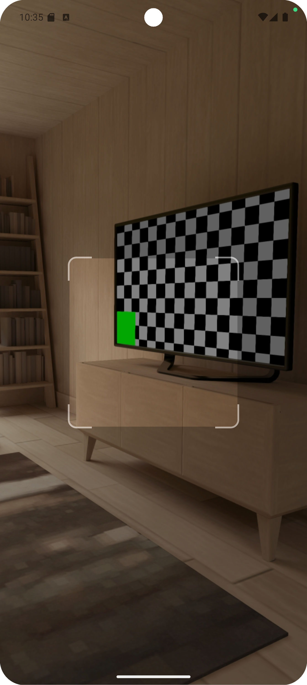
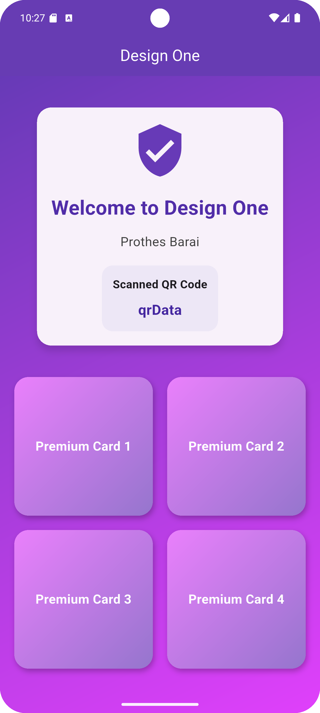
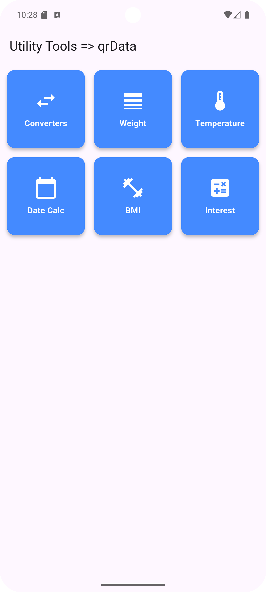

# 🚀 Vendor Dashboard Profile Viewer (by QR Code)

This Flutter project allows users to **scan a QR Code** generated from the main project 👉 [prothes_vendor-dashboard](https://github.com/prothesbarai/prothes_vendor-dashboard)  
and **instantly navigate** to the corresponding vendor’s profile page using a **unique key-based system**. 🔑

---

## 🧠 How It Works
1. 📱 **Generate QR Code** → From the main project (`prothes_vendor-dashboard`), each vendor has a unique key.
2. 📷 **Scan QR Code** → This app scans that QR code using the device camera.
3. 🔗 **Navigate to Profile** → Based on the decoded key, it fetches and displays the vendor's profile dynamically.

---

## 🧩 Features
- ✅ QR Code Scanning (Camera Based)
- 🔑 Key-based Profile Routing
- ⚡ Instant Navigation
- 🎨 Simple & Clean UI
- 💬 Easy Integration with Existing Dashboard

---

## 🛠️ Tech Stack
| Technology | Purpose |
|-------------|----------|
| Flutter     | App Framework 🧱 |
| Dart        | Programming Language 💻 |
| QR Code Scanner | QR Code Detection & Decoding 📷 |
| REST API    | Vendor Data Fetching 🌐 |

---

## 🚀 Project Setup

### 🔹 1. Clone the Repository
```bash
git clone https://github.com/prothesbarai/prothes_vendor_dashboard_profile_show_by_qrcode.git
```

### 🔹 2. Install Dependencies
```bash
flutter pub get
```

### 🔹 3. Run the App
```bash
flutter run
```

---

## 🖼️ Screenshots
<table>
  <tr>
    <td></td>
    <td></td>
    <td></td>
    <td></td>
  </tr>
</table>


## 🔗 Related Project
👉 [Vendor Dashboard (Main Project)](https://github.com/prothesbarai/prothes_vendor-dashboard)
---

## 👨‍💻 Author
**Prothes Barai**  
📧 Email: [developerprothes16@gmail.com]  
🌐 GitHub: [prothesbarai](https://github.com/prothesbarai)

---

## ⭐ Support
If you like this project, don’t forget to give it a **⭐ on GitHub** 😍  